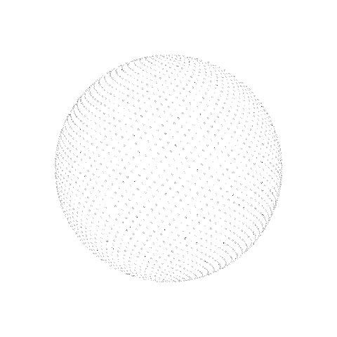
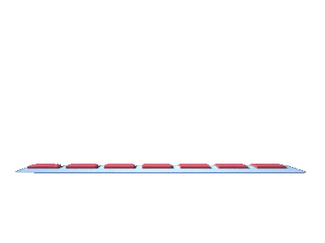

  <h1>Hi, I am Muhammed Shamil </h1>

  

  
  
  
  

  <h4>We handle the complexity in the dark, so every experience feels effortless in the light.</h4>

<picture>
  <source srcset="" media="(max-width: 900px)" width="0" height="0">
  
</picture>

##  About me

 

  <ul>
    <li>💻 Backend Engineer focused on <strong>Go</strong> and <strong>Distributed Systems</strong>.</li>
    <li>🚀 Co-Founder & Lead Backend Engineer at <strong><a href="https://thefitduel.com">FitDuel</a></strong>.</li>
    <li>⚙️ Building with <strong>Go</strong>, <strong>PostgreSQL</strong>, <strong>Redis</strong>, <strong>AWS</strong>, and <strong>Docker</strong>.</li>
    <li>🧠 Interested in clean code, system design, and scalability.</li>
    <li>🤝 Helping grow the developer community in Kerala.</li>
  </ul>

 

---

###  Featured Projects

** [FitDuel](https://thefitduel.com)** · `Go` `WebSocket` `Redis` `PostgreSQL`

> Real-time multiplayer fitness platform with live 1v1 workout duels and scalable backend services.

** [ExamMaster](https://exammaster.shamilkp.me)** · `Go` `React` `PostgreSQL` `Cloudflare R2`

> Production SaaS that automates exam seating, roster processing, and document generation.

---

###  Tech Stack

---

###  GitHub Stats

  
  

  

